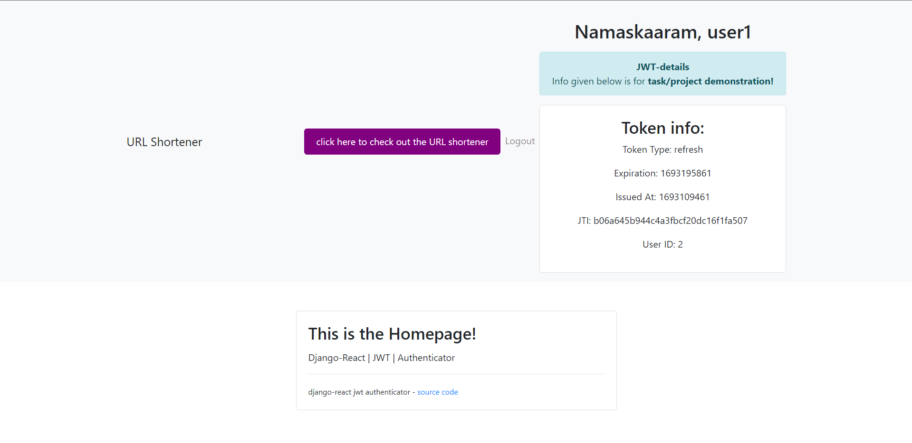
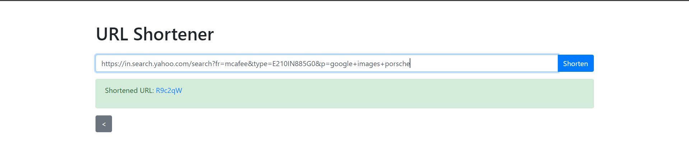
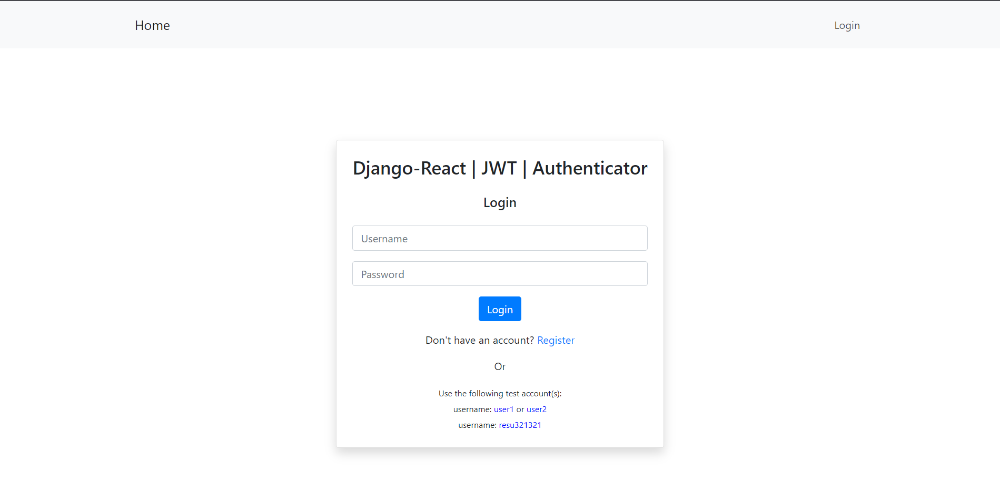
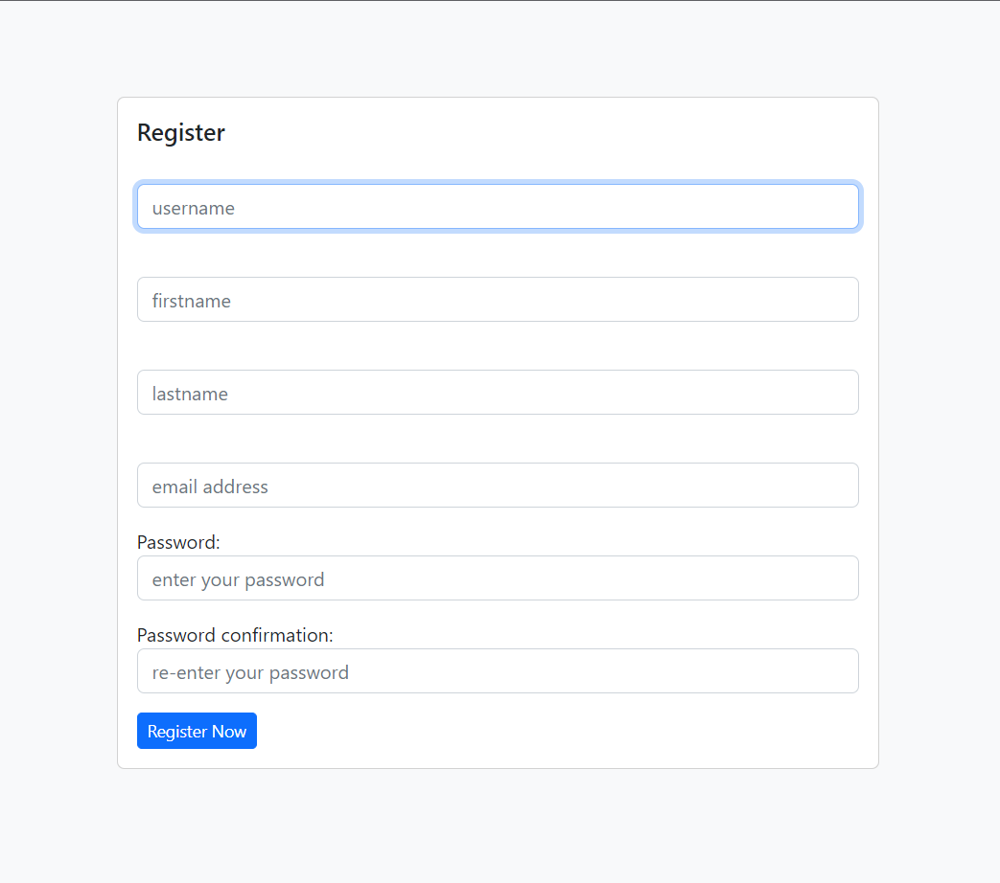
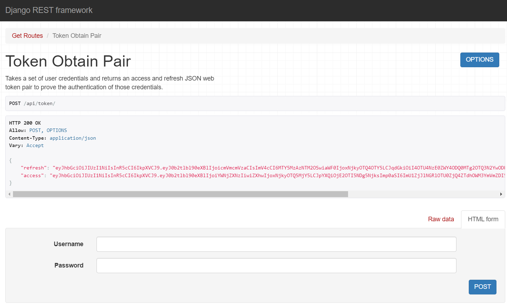

# Django-React URL Shortener

##### This document has been authored by referencing the content provided in the `backendinfo.txt` and `frontendinfo.txt` files. For more comprehensive information about the project, kindly consult those aforementioned files.

### Info to run the project has been given in the "Running the Project" section

This project is a URL shortener application built using Django for the backend and React for the frontend. It allows users to shorten long URLs and access them via the generated short URLs. The application also features jwt based user authentication, private routes.

#### Project snippets/images can be viewed in the images directory in the root.

## Homepage

Homepage of this application contains link to url-shortener, jwt token details (for project demonstration), logout feature.



## URL-shortener page

You can copy and paste the URL you wish to shorten, and the resulting shortened URL can then be utilized to access the original page.



## Login page



## Register page



## Backend Setup

1. Create the Django project and app:
   ```bash
   django-admin startproject backend
   python manage.py startapp application
   ```

2. Install required packages:
   ```bash
   pip install django djangorestframework djangorestframework-simplejwt django-cors-headers
   ```

JWT token pair


   
3. Configure CORS:
   In `settings.py`, set `CORS_ALLOW_ALL_ORIGINS = True` to enable communication between the frontend and backend.

4. Set up models, authentication, and URL endpoints according to the backend information provided.

## Frontend Setup

1. Create the React app:
   ```bash
   npx create-react-app frontend
   ```

2. Install required packages:
   ```bash
   npm install react-router-dom jwt-decode
   ```

3. Set up components, context, pages, and utils directories as described.

4. Configure private routes and token management using the information provided.

## Running the Project

### Backend:
1. Activate the virtual environment:
   ```bash
   venv/Scripts/activate
   ```

2. Run the backend server:
   ```bash
   python manage.py runserver
   ```

### Frontend:
1. Navigate to the frontend directory:
   ```bash
   cd frontend
   ```

2. Run the frontend development server:
   ```bash
   npm start
   ```

## Notable URLs

- Backend API: http://127.0.0.1:8000/api/
- Token Obtain: http://127.0.0.1:8000/api/token/
- Token Refresh: http://127.0.0.1:8000/api/token/refresh/
- User Registration: http://127.0.0.1:8000/register/registeruser/
- URL Shortener: http://127.0.0.1:8000/register/shorten/

## Usage

1. Access the frontend at `http://localhost:3000`.
2. Register or log in with an existing account.
3. Use the URL shortener to generate short URLs for long URLs.
4. Access private routes to view and manage your notes.

## License

This project is licensed under the [MIT License](LICENSE).

## References

- Programming Assistance: Documentations, Youtube, Stackoverflow, ChatGPT
- Text/Document Refactoring: ChatGPT
- Aesthetic/UI Support: ChatGPT

